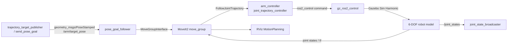
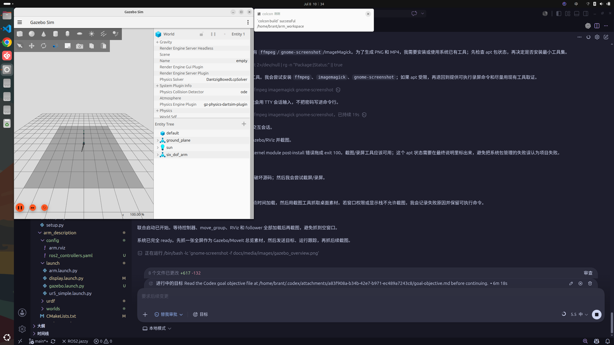
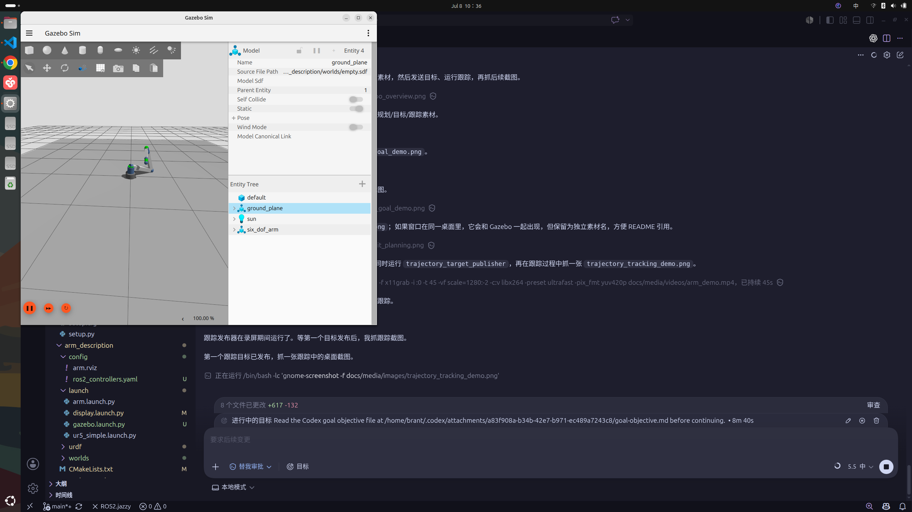
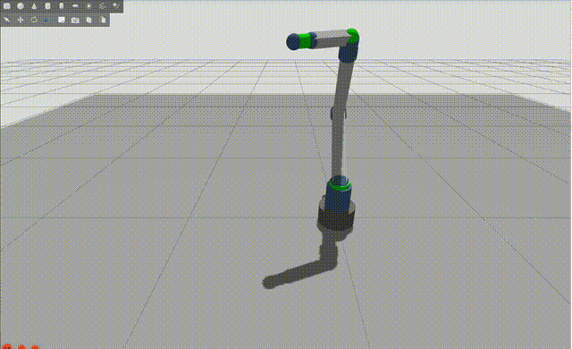

# ROS2 Jazzy 六自由度机械臂仿真项目

这是一个基于 **ROS2 Jazzy + Gazebo Sim Harmonic + MoveIt2 + ros2_control** 的 6-DOF 机械臂仿真项目。项目包含机械臂 URDF/Xacro 建模、Gazebo 仿真控制、MoveIt2 正逆运动学与路径规划、目标位姿执行，以及低频末端目标跟踪 demo。

本仓库适合作为个人项目记录，也可作为后续同学学习 ROS2 机械臂仿真、MoveIt2 配置和 Gazebo Harmonic 集成的复现参考。

## 项目信息

| 项目 | 内容 |
| --- | --- |
| 作者 / 维护者 | Brant |
| 许可证 | MIT License |
| 项目定位 | ROS2 Jazzy 机械臂仿真、MoveIt2 规划与末端位姿跟踪集成项目 |

## 功能特性

| 功能 | 当前状态 |
| --- | --- |
| 6 自由度机械臂 URDF/Xacro 模型 | 已实现 |
| Gazebo Sim Harmonic 仿真 | 已实现 |
| `gz_ros2_control` 接入 | 已实现 |
| `joint_state_broadcaster` | 已实现 |
| `joint_trajectory_controller` | 已实现，控制器名 `arm_controller` |
| MoveIt2 规划组 | 已实现，planning group 为 `arm` |
| KDL IK / FK | 已配置 |
| RViz MotionPlanning | 已配置 |
| 单个末端目标位姿执行 | 已实现，话题 `/arm/target_pose` |
| 低频末端目标跟踪 demo | 已实现，支持 `line` / `circle` / `square` |

## 系统架构



核心链路：

1. 发布目标末端位姿到 `/arm/target_pose`；
2. `pose_goal_follower` 调用 MoveIt2 对 `tool_link` 做 IK 与规划；
3. MoveIt2 将轨迹发送到 `/arm_controller/follow_joint_trajectory`；
4. `gz_ros2_control` 在 Gazebo Harmonic 中驱动机械臂执行；
5. `/joint_states` 和 TF 回流给 MoveIt2 与 RViz。

## 软件环境要求

推荐环境：

| 项目 | 版本 |
| --- | --- |
| OS | Ubuntu 24.04 |
| ROS | ROS2 Jazzy |
| Gazebo | Gazebo Sim Harmonic |
| MoveIt | MoveIt2 for Jazzy |
| 构建工具 | colcon / ament_cmake |

每个新终端先执行：

```bash
source /opt/ros/jazzy/setup.bash
```

## 工作空间结构

```text
arm_workspace/
├── README.md
├── LICENSE
├── docs/
│   ├── quick_start.md
│   ├── project_structure.md
│   ├── troubleshooting.md
│   └── media/
│       ├── images/
│       │   ├── gazebo_overview.png
│       │   ├── moveit_planning.png
│       │   ├── pose_goal_demo.png
│       │   └── trajectory_tracking_demo.png
│       └── videos/
│           ├── arm_demo.mp4
│           └── arm_demo_preview.gif
└── src/
    ├── arm_description/
    │   ├── config/ros2_controllers.yaml
    │   ├── launch/gazebo.launch.py
    │   ├── urdf/robot_arm.urdf.xacro
    │   └── worlds/empty.sdf
    ├── arm_moveit_config/
    │   ├── config/
    │   ├── launch/demo_gazebo.launch.py
    │   └── rviz/moveit.rviz
    └── arm_controller/
        ├── launch/
        └── src/
```

详细说明见 [docs/project_structure.md](docs/project_structure.md)。

## 安装依赖

安装主要 apt 依赖：

```bash
sudo apt update
sudo apt install -y \
  python3-colcon-common-extensions \
  python3-rosdep \
  ros-jazzy-controller-manager \
  ros-jazzy-gz-ros2-control \
  ros-jazzy-joint-state-broadcaster \
  ros-jazzy-joint-trajectory-controller \
  ros-jazzy-moveit-kinematics \
  ros-jazzy-moveit-planners-ompl \
  ros-jazzy-moveit-ros-move-group \
  ros-jazzy-moveit-ros-planning-interface \
  ros-jazzy-moveit-ros-visualization \
  ros-jazzy-moveit-simple-controller-manager \
  ros-jazzy-ros-gz-bridge \
  ros-jazzy-ros-gz-sim \
  ros-jazzy-rviz2 \
  ros-jazzy-xacro
```

使用 rosdep 补齐依赖：

```bash
cd /home/brant/arm_workspace
rosdep install --from-paths src --ignore-src -r -y
```

## 编译方法

如果 `install/` 中存在失效符号链接，清理生成目录即可。不要删除 `src/`。

```bash
cd /home/brant/arm_workspace
rm -rf build install log
source /opt/ros/jazzy/setup.bash
colcon build --symlink-install
source install/setup.bash
```

检查 xacro：

```bash
xacro src/arm_description/urdf/robot_arm.urdf.xacro > /tmp/robot_arm_check.urdf
```

## 快速开始

### 只启动 Gazebo

```bash
cd /home/brant/arm_workspace
source install/setup.bash
ros2 launch arm_description gazebo.launch.py
```

另开终端检查控制器：

```bash
source /home/brant/arm_workspace/install/setup.bash
ros2 control list_controllers
ros2 topic echo /joint_states --once
ros2 action list | grep follow_joint_trajectory
```

期望看到：

- `joint_state_broadcaster` 为 `active`;
- `arm_controller` 为 `active`;
- `/joint_states` 有数据;
- `/arm_controller/follow_joint_trajectory` 存在。

### Gazebo + MoveIt2 联合启动

```bash
cd /home/brant/arm_workspace
source install/setup.bash
ros2 launch arm_moveit_config demo_gazebo.launch.py
```

无 RViz 终端验证：

```bash
ros2 launch arm_moveit_config demo_gazebo.launch.py rviz:=false
```

### 发送单个末端目标位姿

`pose_goal_follower` 订阅：

```text
/arm/target_pose
```

消息类型：

```text
geometry_msgs/msg/PoseStamped
```

发送一个保守可达目标：

```bash
source /home/brant/arm_workspace/install/setup.bash
ros2 run arm_controller send_pose_goal --ros-args \
  -p x:=0.35 \
  -p y:=0.0 \
  -p z:=0.45 \
  -p qx:=0.0 \
  -p qy:=0.0 \
  -p qz:=0.0 \
  -p qw:=1.0
```

### 运行末端跟踪 demo

```bash
source /home/brant/arm_workspace/install/setup.bash
ros2 run arm_controller trajectory_target_publisher --ros-args \
  -p mode:=circle \
  -p radius:=0.05 \
  -p center_x:=0.35 \
  -p center_y:=0.0 \
  -p center_z:=0.45 \
  -p rate:=0.05 \
  -p points_per_cycle:=4
```

支持轨迹模式：

| mode | 含义 |
| --- | --- |
| `line` | 沿 y 方向低频直线目标 |
| `circle` | 在 y-z 平面发布圆形目标 |
| `square` | 在 y-z 平面发布方形目标 |

当前实现是 **MoveIt2 规划式低频跟踪**。推荐 `rate:=0.05` 到 `0.1`，如果需要高频实时笛卡尔伺服，应接入 MoveIt Servo。

## 核心节点、话题与控制器

### 节点

| 节点 / 可执行程序 | 包 | 作用 |
| --- | --- | --- |
| `robot_state_publisher` | 系统包 | 发布 TF |
| `move_group` | MoveIt2 | 运动规划、IK、轨迹执行接口 |
| `pose_goal_follower` | `arm_controller` | 接收目标位姿，调用 MoveIt2 规划执行 |
| `send_pose_goal` | `arm_controller` | 命令行发送单个目标 |
| `trajectory_target_publisher` | `arm_controller` | 连续发布 line/circle/square 目标 |

### 话题 / action

| 名称 | 类型 | 说明 |
| --- | --- | --- |
| `/arm/target_pose` | `geometry_msgs/msg/PoseStamped` | 末端目标位姿 |
| `/joint_states` | `sensor_msgs/msg/JointState` | Gazebo/ros2_control 关节状态 |
| `/tf` | `tf2_msgs/msg/TFMessage` | 机器人 TF |
| `/arm_controller/follow_joint_trajectory` | action | MoveIt2 执行轨迹 |

### 控制器

| 控制器 | 类型 |
| --- | --- |
| `joint_state_broadcaster` | `joint_state_broadcaster/JointStateBroadcaster` |
| `arm_controller` | `joint_trajectory_controller/JointTrajectoryController` |

受控关节：

```text
shoulder_pan_joint
shoulder_lift_joint
elbow_joint
wrist_1_joint
wrist_2_joint
wrist_3_joint
```

## 末端目标位姿控制说明

`pose_goal_follower` 的流程：

1. 接收 `/arm/target_pose`;
2. 如果 `frame_id` 为空，使用 MoveIt planning frame；
3. 默认对 `tool_link` 设置 position-only target；
4. 调用 MoveIt2/KDL 进行 IK 与 OMPL 规划；
5. 将轨迹发送到 `arm_controller`;
6. 执行后通过 TF 计算当前 `tool_link` 与目标点的误差。

默认 position-only 是为了提高当前 Gazebo demo 的稳定性。代码仍会输出姿态误差，方便后续升级到完整姿态控制。

## 运动学与逆运动学说明

MoveIt2 使用 `arm_moveit_config/config/robot_arm.srdf` 定义规划组：

- planning group: `arm`
- base: `world` / `base_link`
- tip link: `tool_link`
- joints: 6 个 revolute joints

IK 插件在 `kinematics.yaml` 中配置为 KDL：

```yaml
arm:
  kinematics_solver: kdl_kinematics_plugin/KDLKinematicsPlugin
```

正运动学由 URDF/Xacro 中的 link-joint tree 和 MoveIt RobotModel 计算；逆运动学由 KDL 根据目标 `tool_link` 位姿求解；轨迹规划由 OMPL 完成。

## 仿真效果展示

### 截图

素材已保存到 `docs/media/images/`：

| 文件 | 内容 |
| --- | --- |
| [gazebo_overview.png](docs/media/images/gazebo_overview.png) | Gazebo + RViz 整体运行画面 |
| [moveit_planning.png](docs/media/images/moveit_planning.png) | RViz / MoveIt2 MotionPlanning 界面 |
| [pose_goal_demo.png](docs/media/images/pose_goal_demo.png) | 单个目标位姿执行后的画面 |
| [trajectory_tracking_demo.png](docs/media/images/trajectory_tracking_demo.png) | 末端跟踪 demo 运行画面 |

Gazebo / MoveIt 总览：



末端跟踪 demo：



### 视频

素材已保存到 `docs/media/videos/`：

| 文件 | 内容 |
| --- | --- |
| [arm_demo.mp4](docs/media/videos/arm_demo.mp4) | 45 秒演示视频 |
| [arm_demo_preview.gif](docs/media/videos/arm_demo_preview.gif) | 12 秒 README 预览动图 |

预览：




## 常见问题与排查

更多排障见 [docs/troubleshooting.md](docs/troubleshooting.md)。

### 模型不显示

检查 xacro 和 spawn 输出：

```bash
xacro src/arm_description/urdf/robot_arm.urdf.xacro > /tmp/robot_arm_check.urdf
```

启动日志中应出现：

```text
Entity creation successful.
```

### controller inactive

```bash
ros2 control list_controllers
```

确认 `joint_state_broadcaster` 和 `arm_controller` 为 `active`。如果不是，检查 `ros2_controllers.yaml` 中 joint 名称是否与 URDF 完全一致。

### MoveIt 找不到 controller

```bash
ros2 action list | grep arm_controller
```

期望：

```text
/arm_controller/follow_joint_trajectory
```

### IK failed

先用保守目标测试：

```text
x=0.35, y=0.0, z=0.45, qw=1.0
```

若完整姿态目标失败，可先使用默认 position-only 模式验证可达性。

### Gazebo 没启动成功

检查是否缺少 Gazebo Harmonic / `ros_gz_sim` / `gz_ros2_control`。NVIDIA/Wayland 环境可能出现 `libEGL warning`，如果仿真仍运行且 `/joint_states` 正常，通常不是致命错误。

### 没有 joint_states

```bash
ros2 topic echo /joint_states --once
```

如果无数据，检查 Gazebo 是否暂停、模型是否成功加载、`joint_state_broadcaster` 是否 active。

### install 符号链接失效

```bash
rm -rf build install log
colcon build --symlink-install
source install/setup.bash
```

不要删除 `src/`。

## 可扩展方向

可扩展方向：

- 接入 MoveIt Servo，实现高频实时笛卡尔伺服；
- 增加夹爪、碰撞物体和抓取任务；
- 替换为真实机器人尺寸和网格模型；
- 增加 rosbag / benchmark / 自动化测试；
- 接入视觉目标检测，将目标位姿由感知模块产生。

## 致谢与参考资源

- 感谢 SAOUDI-Hacene 提供的原始 6-DOF 机械臂模型参考。本仓库在该模型基础上完成 ROS2 Jazzy、Gazebo Harmonic、ros2_control、MoveIt2 和末端目标跟踪集成。
- ROS 2 Jazzy documentation
- Gazebo Sim Harmonic documentation
- MoveIt 2 documentation
- ros2_control documentation
- KDL kinematics plugin

## License

本项目使用 MIT License，见 [LICENSE](LICENSE)。
